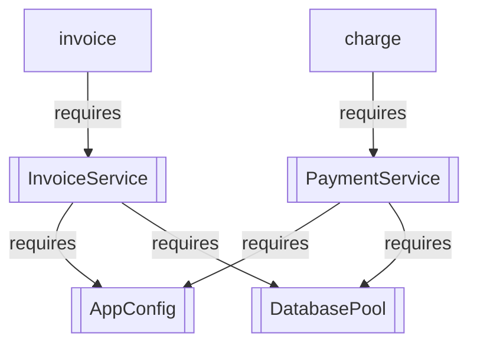

# Dependency Injection

GritShield has two independent DI engines. This example runs both in one
binary, on one router, so you can see what each one costs you.

```bash
cargo run --manifest-path examples/dependency_injection/Cargo.toml
```

No database, no Redis, no session. Every endpoint either receives a dependency
as a handler argument or was handed one before the server started.

```text
curl -X POST http://127.0.0.1:8085/api/billing/charge \
  -H 'Content-Type: application/json' -d '{"amount_cents": 4200}'
curl http://127.0.0.1:8085/api/billing/invoice/acme
curl http://127.0.0.1:8085/api/billing/graph
curl http://127.0.0.1:8085/api/strict/info
```

## The two paradigms

| | A: dynamic | B: compile-time |
|---|---|---|
| You write | `#[component]` / `#[derive(GritComponent)]` | `#[derive(WireContainer)]` + `#[derive(GritWire)]` |
| Wiring happens | at boot, inside `Router::new()` | in `main`, when you call `wire()` |
| Missing dependency | boot panic, or a compile error for handler params | compile error, always |
| `main.rs` when you add a service | unchanged | unchanged |
| `main.rs` when you add a controller | unchanged | you mount it by hand |
| Resolution cost | a `TypeId` lookup per request | none - fields are already there |

Neither is a wrapper around the other. Paradigm A resolves out of a global
`CONTEXT`; Paradigm B never touches it.

## Paradigm A: constructor injection

```rust
pub struct DatabasePool { pub label: String }

#[component]
impl DatabasePool {
    pub fn new() -> Self { Self { label: "in-memory".to_string() } }
    pub fn query(&self, sql: &str) -> String { format!("[{}] {}", self.label, sql) }
}
```

`#[component]` needs an associated `pub fn new(...)`. Every parameter of `new`
is a declaration of what the container must provide before it can build this
type - there is no other place to say so. Then handlers ask for the result:

```rust
#[post("/charge")]
pub async fn charge(ctx: RequestContext, payments: Arc<PaymentService>) -> ShieldResult<Response> {
    // ... `payments` came from the container; the body never says so
}
```

Two dependency styles are supported, and they behave differently:

```rust
#[component]
impl PaymentService {
    pub fn new(db: Arc<DatabasePool>, config: AppConfig) -> Self { /* ... */ }
}
```

`Arc<DatabasePool>` is handed over as-is: every request shares one pool.
A non-`Arc` parameter is rewritten by the macro into `(*resolved).clone()`, so
the value is copied per component - which is why `AppConfig` has to be `Clone`,
and why this is the wrong shape for a connection pool.

## Paradigm A: field injection

`#[derive(GritComponent)]` does the same job through struct fields:

```rust
#[derive(Clone, GritComponent)]
pub struct InvoiceService {
    pub db: Arc<DatabasePool>,
    pub config: AppConfig,
}
```

Use it when the type is mostly a bag of collaborators and a constructor would
be nothing but a field list. Both styles produce the same `CONTEXT` entry, and
handlers ask for either one the same way.

## Values the container cannot build

A config struct or a third-party client is something you already have, not
something with a constructor worth calling. Register it explicitly, in two
steps:

```rust
// module scope, because it expands to an `impl`
mark_injectable!(AppConfig);

// anywhere, before `Router::new()`
inject!(AppConfig, AppConfig { currency: "EUR".to_string(), max_amount_cents: 100_000 });
```

`mark_injectable!` is not optional. Without it `inject!` still stores the value,
but a handler asking for that type does not compile.

**Put `inject!` above `Router::new()`.** Not because the graph check would
notice - it would not. `inventory::submit!` expands to a process constructor, so
the graph entry exists before `main` runs. What is ordered is the value itself,
because the boot hooks resolve their dependencies during `Router::new()`. Move
it down and boot dies with:

```text
Critical Bootstrap DI Fault: Failed to resolve dependency 'AppConfig'
required by component 'PaymentService'
```

## Paradigm B: the compile-time container

```rust
#[derive(Clone, WireContainer)]
pub struct AppContainer {
    pub db: Arc<DatabasePool>,
    pub payments: Arc<PaymentService>,
    pub config: Arc<AppConfig>,
}

#[derive(GritWire)]
pub struct CheckoutController {
    pub payments: Arc<PaymentService>,
    pub config: AppConfig,
}

let checkout = CheckoutController::wire(&container);
```

`WireContainer` generates a `HasComponent<T>` impl per field. `GritWire`
generates `wire<C>(&C) -> Arc<Self>` with a `C: HasComponent<Field>` bound for
each field. Nothing is looked up at runtime: the controller's fields *are* the
container's fields.

Every **container** field must be an `Arc<T>` - `HasComponent::get_component`
returns an `Arc<T>`, and the derive clones the field straight into that return
type. A controller may mix the two: `payments: Arc<PaymentService>` is moved,
`config: AppConfig` is cloned out of the container's `Arc`.

Mount it by hand, because nothing is discovered:

```rust
router.route((
    "/api/strict/info",
    HttpMethod::GET,
    move |_ctx: RequestContext| {
        let info = info.clone();
        async move { Response::ok(info.describe()) }.boxed()
    },
))
```

The closure is the whole ownership story: one `Arc<CheckoutController>`, cloned
into each request.

## How failures surface

Three different mechanisms, three different messages. All three are real output
from this example.

**A handler parameter whose type was never made injectable** is a compile
error, not a boot panic:

```text
error[E0277]: the trait bound `InvoiceService: RuntimeInjectable` is not satisfied
```

**A component whose dependency has no provider at all** fails at boot, from
inside `Router::new()`, and every missing edge is listed at once:

```text
thread 'main' panicked at src/core/ioc.rs:169:13:
GritShield DI graph is incomplete (2 missing dependencies):
  - 'InvoiceService' requires 'DatabasePool', but nothing registered that type. Add #[component] / #[derive(GritComponent)] to it, or register it explicitly with inject!(DatabasePool, ...).
  - 'PaymentService' requires 'DatabasePool', but nothing registered that type. Add #[component] / #[derive(GritComponent)] to it, or register it explicitly with inject!(DatabasePool, ...).
```

**A container missing a field the controller needs** is a compile error, with
the container named:

```text
error[E0277]: the trait bound `AppContainer: HasComponent<PaymentService>` is not satisfied
  --> src/strict.rs:69:45
   |
69 |     let checkout = CheckoutController::wire(&container);
   |                    ^^^^^^^^^^ unsatisfied trait bound
```

Paradigm A's "it panics at boot" is therefore the *worst* case, not the common
one: a missing provider on something you inject by name is caught by the
compiler, and only an unresolvable edge between two components defers to boot.

## Inspecting the graph

The container's own view of your application, served as Mermaid:

```bash
curl http://127.0.0.1:8085/api/billing/graph
```



Note the last two edges: a handler that injects a component is itself part of
the graph, with the handler's function name as the node. That is the same
inventory that feeds the admin panel's topology view.
`AutoWire::export_dot()` gives you the same thing as Graphviz.

## Sharp edges

- **`#[grit(skip)]` zeroes the field, it does not inject it.** The derive
  expands a skipped field to `unsafe { std::mem::zeroed() }`. That is only
  correct for a type whose zero value *is* the absence of the thing - an
  `Option<Client>`, a `MaybeUninit` wrapper you initialize yourself later. It
  is not a way to have the container manage the field.
- **Components are cached, not scoped.** `CONTEXT.resolve` memoizes the first
  instance it builds, so a component is effectively a singleton for the life of
  the process despite being tagged `ComponentKind::Transient`.
- **Handler-argument injection happens per request.** Every injected parameter
  is a `TypeId` hash lookup in a `RwLock` on the hot path. If a dependency is on
  a hot endpoint and the argument is not the point, inject the service once
  through `#[controller]` or Paradigm B instead.
- **`Router::new()` is the boot.** Anything you want in `CONTEXT` must exist
  before it, which makes `Router::new()` an awkward line to have early in a long
  `main`.

## Files

| File | What it shows |
|------|---------------|
| `src/components.rs` | `#[component]`, `#[derive(GritComponent)]`, `mark_injectable!` |
| `src/dynamic.rs` | Paradigm A handlers, including the graph endpoint |
| `src/strict.rs` | Paradigm B: container, wired controller, manual routes |
| `src/main.rs` | `inject!`, the boot, and both containers |
